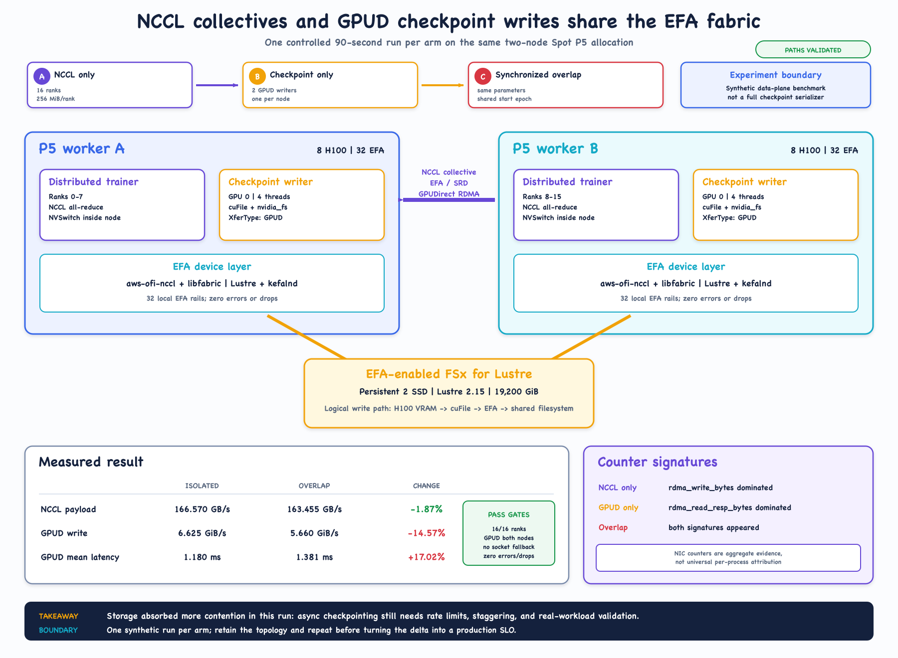
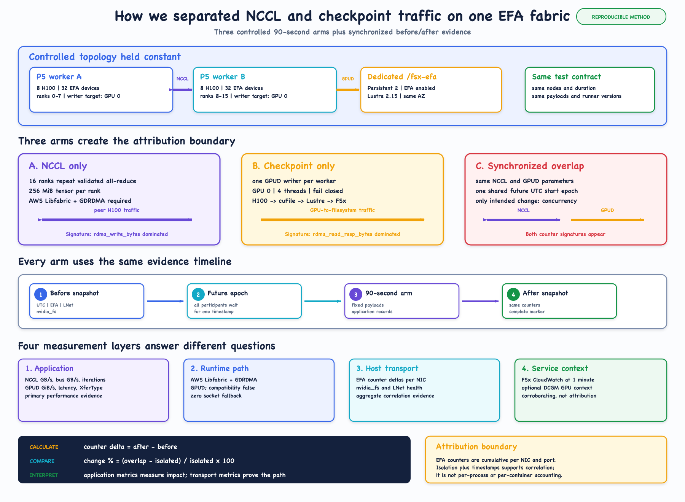

# P5 EFA and FSx contention lab

[](https://github.com/murubhas/p5-efa-fsx-contention-lab/actions/workflows/validate.yml)

A reproducible AWS ParallelCluster experiment that measures what happens when
multi-node NCCL collectives and GPU-direct checkpoint writes use the EFA fabric
at the same time.

The validated topology used two Spot `p5.48xlarge` workers, 16 NVIDIA H100
GPUs, AWS Libfabric/GDRDMA for NCCL, and a dedicated EFA-enabled FSx for Lustre
Persistent 2 filesystem for GPUD writes.

> **Measured result, not a universal claim:** in one controlled 90-second run
> per arm, overlap reduced NCCL payload throughput by 1.9%, reduced checkpoint
> write throughput by 14.6%, and increased checkpoint mean latency by 17.0%.
> Repeat the experiment before turning these values into policy.

## Start here

| Goal | Resource |
|---|---|
| Present or skim the whole result in 15 minutes | [Fifteen-minute demo deck](https://murubhas.github.io/p5-efa-fsx-contention-lab/docs/p5-efa-fsx-contention-15min-demo.html) |
| Understand the experiment visually | [Animated five-phase explainer](https://murubhas.github.io/p5-efa-fsx-contention-lab/docs/p5-efa-fsx-contention-animation.html) |
| Reproduce it from a clean clone | [Reproduction guide](storage-benchmark/REPRODUCTION.md) |
| Understand metric ownership | [Metrics and attribution guide](storage-benchmark/METRICS.md) |
| Read the validated result | [Validation report](results/fsx-efa-gds-contention-validation.md) |
| Consume machine-readable values | [Result summary](results/fsx-efa-gds-contention-summary.json) |
| Review infrastructure ownership | [Terraform design](terraform/README.md) |

## The question

A distributed trainer may execute NCCL collectives while a checkpoint writer
moves tensor data from GPU memory to shared storage. On the tested P5 stack,
both data paths can use EFA:

```text
Collectives:
PyTorch -> NCCL -> aws-ofi-nccl -> libfabric -> EFA / SRD

Checkpoint I/O:
GPU -> cuFile / nvidia_fs -> Lustre / kefalnd -> EFA / SRD -> FSx
```

The experiment asks a narrow question: when those paths overlap on the same
two workers and filesystem, how do application-level throughput and latency
change?



## Controlled method

Three matched arms run on one exclusive two-node allocation:

1. **NCCL only:** 16-rank, correctness-checked all-reduce.
2. **Checkpoint only:** one fail-closed GPUD writer per worker.
3. **Synchronized overlap:** both workloads begin at the same future UTC epoch.

The isolated arms establish each workload's baseline and EFA-counter signature.
The overlap arm quantifies application impact while preserving the same worker
fleet, duration, payloads, and filesystem.

| Controlled property | Validated value |
|---|---|
| Compute | 2 x Spot `p5.48xlarge` |
| GPU topology | 8 x H100 80 GiB per worker; 16 total |
| EFA topology | 32 EFA devices per worker |
| NCCL world | 16 ranks; 8 per worker |
| Storage | EFA-enabled FSx for Lustre Persistent 2 SSD |
| Filesystem capacity | 19,200 GiB at 1,000 MB/s/TiB |
| Arm duration | 90 seconds |

## Validated result

| Metric | Isolated | Overlap | Change |
|---|---:|---:|---:|
| NCCL algorithmic payload | 166.570 GB/s | 163.455 GB/s | -1.87% |
| NCCL estimated bus bandwidth | 312.319 GB/s | 306.478 GB/s | -1.87% |
| Checkpoint aggregate write | 6.625 GiB/s | 5.660 GiB/s | -14.57% |
| Checkpoint mean latency | 1.180 ms | 1.381 ms | +17.02% |

The storage path absorbed more contention than the collective path in this
run. That supports testing checkpoint staggering, rate limiting, and real
application checkpoint stacks. It does not prove that every P5 or FSx workload
will behave the same way.

## Evidence model

Application metrics are authoritative for performance:

- the NCCL benchmark reports rank correctness, payload GB/s, and bus GB/s;
- `gdsio` reports `GPUD`, GiB/s, and operation latency.

Runtime and host evidence prove the intended path:

- NCCL logs must show AWS Libfabric/GDRDMA and no `NET/Socket` fallback;
- cuFile compatibility fallback must be disabled;
- `nvidia_fs`, LNet, and EFA counters must remain error-free;
- EFA before/after deltas correlate transport activity with each exact window.



EFA counters are cumulative per NIC and port. They do **not** attribute bytes
to a process, container, NCCL communicator, or cuFile handle. The isolated arms
support controlled correlation; they do not turn NIC counters into per-process
accounting.

## Repository map

```text
.
|-- assets/                 Static architecture and attribution diagrams
|-- docs/                   Self-contained HTML explainer and demo deck
|-- results/                Sanitized human- and machine-readable evidence
|-- storage-benchmark/      NCCL, GDS, fio, inventory, and counter tools
|-- terraform/              ParallelCluster and optional EFA-enabled FSx
|-- cluster.template.yaml   Slurm queue and P5/EFA cluster contract
`-- scripts/                Publication and visual-verification checks
```

## Quick local validation

```bash
npm ci
terraform -chdir=terraform init -backend=false -input=false
npm run check
```

The Terraform tests use mocked providers and create no AWS resources. A real
plan against reviewed VPC, subnet, security-group, FSx, and S3 inputs is still
required before deployment.

On macOS with Google Chrome installed, validate both published pages. The
animation is checked at four viewport sizes plus reduced-motion mode; the demo
deck is checked in read and present mode at four viewport sizes plus the light
theme, and every chapter must fit its slide without overflowing.

```bash
npm run verify:visuals
```

## Cost and safety boundary

- The elastic P5 queue is configured with `MinCount: 0` and `MaxCount: 2`.
- The reproduction guide uses an exclusive Slurm allocation so both workers
  arrive before an arm begins.
- The optional EFA-enabled filesystem is separate from the shared `/fsx`
  mount, tagged `auto-delete=no`, and protected by `prevent_destroy`.
- Never publish Terraform state, plans, credentials, account IDs, private IPs,
  generated cluster configuration, or raw logs.
- Spot interruption can invalidate an arm; preserve the partial evidence,
  discard the measurement, and rerun with a new label.

## License

Licensed under the Apache License 2.0. See [LICENSE](LICENSE).
